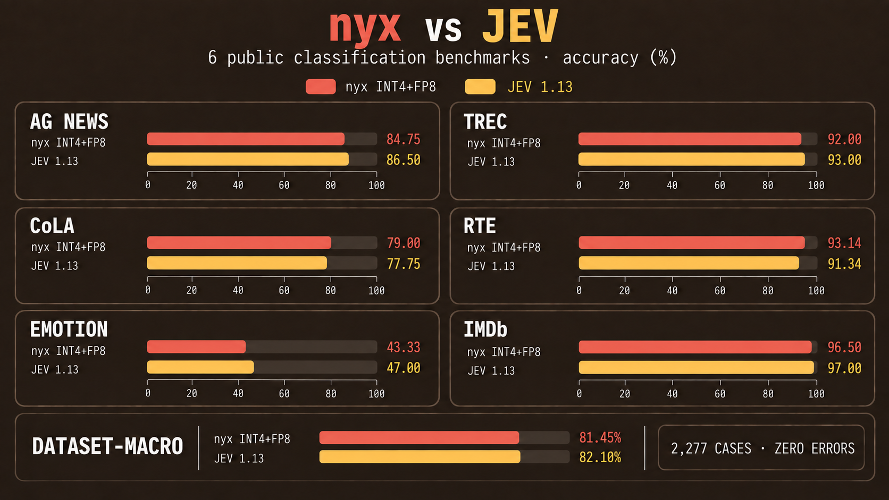

# nyx

Production gateway and typed clients for [`devanshbatham/nyx`](https://huggingface.co/devanshbatham/nyx), a Qwen3.5-35B-A3B decision model with INT4 routed-expert storage and FP8 expert compute. It answers Choice, Score, and Noul questions through `POST /v1/systemone`; it does not generate chat text.



## TypeSafe drop-in

The gateway implements the documented TypeSafe System One request/response wire contract 1:1 for Choice, Score, Noul, model discovery, bearer authentication, and `x-typesafe-request-id`. CI runs the unchanged official Python SDK `0.7.0` end to end against the gateway and contract-tests the official JavaScript SDK `0.6.0`. Existing applications only change their base URL and API key; aliases including `jev-latest`, `jev-preview`, and `jev-1.13.0` are accepted, while responses truthfully identify the model as `nyx`.

```bash
export TYPESAFE_BASE_URL=https://nyx.example.com
export TYPESAFE_API_KEY="$(cat /etc/nyx/api-key)"
```

```python
from typesafe_sdk import Noul, TypeSafeClient

with TypeSafeClient() as client:
    result = client.system_one(
        state="I was charged twice.",
        questions={"billing": Noul(instructions="Is this about billing?")},
    )
```

This is wire compatibility, not behavioral identity: decisions, probabilities, confidence, token accounting, limits, and latency can differ from Jev. Pin the tested SDK version before production rollout; future SDK releases require a fresh compatibility run.

## Performance

These measurements use the same frozen 2,277 requests across AG News, TREC, CoLA, RTE, Emotion, and IMDb. Both models received byte-equivalent request bodies at client concurrency 8, one Choice question per request, with zero errors or retries.

| System | Backend inference median / p95 | HTTP round trip median / p95 | Total wall time | Throughput |
|---|---:|---:|---:|---:|
| nyx INT4+FP8 | 62.97 / 85.30 ms | 66.25 / 89.22 ms | 20,209 ms | 112.67 req/s |
| Jev 1.13 | not exposed | 182.33 / 245.12 ms | 53,666 ms | 42.43 req/s |

nyx ran locally through the API stack on one AMD Instinct MI325X. Jev ran over remote HTTPS on unmatched infrastructure, so its numbers describe observed round trip—not a controlled model-speed comparison. nyx backend inference comes from the local `Server-Timing` header; Jev did not expose server timing. SGLang used continuous batching with `max-running-requests=64`; the benchmark's eight concurrent callers bounded the active batch envelope to eight. See [the complete benchmark](benchmarks/random-six.md).

| Metric | nyx INT4+FP8 | Jev 1.13 |
|---|---:|---:|
| Dataset-macro accuracy | 81.45% | 82.10% |
| Dataset-macro F1 | 81.06% | 81.85% |
| Pooled accuracy | 82.96% | 83.62% |

## Hardware

The model allocates 19.43 GB before workload-dependent KV cache and runtime overhead.

| Device | Status | Practical use |
|---|---|---|
| AMD Instinct MI325X | Tested | Recommended for production concurrency and long contexts |
| AMD Instinct MI300X (`gfx942`) | Expected compatible; not benchmarked here | Production-class capacity with the pinned ROCm/AITER path |
| Supported AMD ROCm GPU, 64 GB+ VRAM | Not individually verified | Comfortable model fit and useful batching headroom |
| Supported AMD ROCm GPU, 32 GB VRAM | Minimum target | Model fit with limited KV cache, context, and concurrency headroom |
| NVIDIA CUDA, Apple Silicon, CPU | Not supported by the bundled launcher | Requires a separately validated runtime |

Host requirements: x86_64 Linux, Docker, ROCm host drivers, at least 64 GB system RAM, and 50 GB free disk. The packaged launcher is pinned to an SGLang image and AMD AITER kernels; do not infer support from weight size alone.

## Deploy

Download and start the private model backend:

```bash
hf download devanshbatham/nyx --local-dir /opt/nyx-model
cd /opt/nyx-model
python3 verify.py
bash serve.sh
```

Install the authenticated gateway in another shell:

```bash
git clone https://github.com/devanshbatham/nyx.git /opt/nyx
python3 -m venv /opt/nyx/.venv
/opt/nyx/.venv/bin/pip install '/opt/nyx[server]'
useradd --system --home /nonexistent --shell /usr/sbin/nologin nyx
install -d -m 0750 -o nyx -g nyx /etc/nyx
install -m 0640 -o root -g nyx /opt/nyx/.env.example /etc/nyx/gateway.env
sudo -u nyx /opt/nyx/.venv/bin/nyx-keygen --output /etc/nyx/api-key
set -a; . /etc/nyx/gateway.env; set +a
/opt/nyx/.venv/bin/nyx-serve
```

```text
application -> HTTPS ingress -> nyx gateway :8000 -> private SGLang :30000
```

Port `30000` is an unauthenticated internal model backend and must remain private. Put TLS in front of the gateway on port `8000`. The gateway adds bearer auth, request/body bounds, admission and rate limits, deadlines, cancellation, typed validation, and process-local metrics. A hardened [systemd unit](deploy/nyx-gateway.service) is included.

```bash
curl http://127.0.0.1:8000/v1/systemone \
  -H "Authorization: Bearer $(cat /etc/nyx/api-key)" \
  -H 'Content-Type: application/json' \
  -d '{"model":"nyx","state":"I loved it","questions":{"sentiment":{"type":"choice","instructions":"Classify sentiment","criteria":{"positive":null,"negative":null}}}}'
```

The gateway defaults to no arbitrary question-count cap; the 2 MiB body limit, token budget, available labels, and local capacity still apply. Tune production admission in [`.env.example`](.env.example).

## Native clients

The official TypeSafe SDKs are the direct migration path. This repository also ships small native clients:

```bash
python -m pip install "git+https://github.com/devanshbatham/nyx.git"
npm install github:devanshbatham/nyx#main
```

```python
from nyx import Client

with Client(api_key="...", base_url="https://nyx.example.com") as client:
    result = client.systemone(
        state="I was charged twice.",
        questions={"billing": {"type": "noul", "instructions": "Is this about billing?"}},
    )
```

```ts
import { Client } from "@devanshbatham/nyx";

const client = new Client({ apiKey: process.env.NYX_API_KEY!, baseUrl: process.env.NYX_BASE_URL! });
```

Keep bearer keys in trusted server-side code.

## Verify

```bash
python -m pip install -e '.[server,test]'
pytest -q
npm ci
npm test
```

## License

Apache-2.0. nyx is derived from [`Qwen/Qwen3.5-35B-A3B`](https://huggingface.co/Qwen/Qwen3.5-35B-A3B); Qwen and Alibaba Cloud are credited as the original model authors. Model weights are distributed separately under the Hugging Face model repository terms. TypeSafe and Jev are compatibility targets; this project is not affiliated with TypeSafe AI.
