# nyx

A compact 4B decision model, production gateway, and typed SDKs for Choice, Score, and Noul. The 3.29 GB GGUF runs through the pinned llama.cpp build on CPU, Apple Metal, NVIDIA CUDA, and AMD HIP. The public API is `POST /v1/systemone`.



## Benchmarks

Accuracy on 2,277 frozen classification requests:

| Benchmark | Qwen3.5-4B base | nyx reference | Jev 1.13 |
|---|---:|---:|---:|
| AG News | **87.75%** | 85.75% | 86.50% |
| TREC coarse | 86.60% | 84.20% | **93.00%** |
| CoLA | 77.75% | **81.50%** | 77.75% |
| RTE | 84.12% | 88.09% | **91.34%** |
| Emotion | **47.67%** | 46.33% | 47.00% |
| IMDb | 95.75% | 95.75% | **97.00%** |
| Dataset-macro accuracy | 79.94% | 80.27% | **82.10%** |
| Pooled accuracy | 81.42% | 81.51% | **83.62%** |
| Round trip, median / p95 | 54.85 / 67.96 ms | 55.56 / 72.77 ms | 182.33 / 245.12 ms |
| Throughput | 17.44 req/s | 17.15 req/s | 42.43 req/s |

Local Qwen and nyx latency: MI325X, concurrency 1. Jev latency: remote HTTPS, concurrency 8. The published 3.29 GB GGUF matched the nyx reference on 98.73% of a separate 1,024-case fidelity set. [Reproduce the nyx/Jev benchmark](benchmarks/).

## Requirements

- 8 GB free RAM or unified memory for a single 4,096-token slot; more for larger contexts or concurrency
- 6 GB free disk for the model, source, and build
- Python 3.11+ and Git
- A recent C++ compiler and CMake
- Optional: Apple Metal, NVIDIA CUDA, or AMD ROCm/HIP for acceleration

## Run

```bash
git clone https://github.com/devanshbatham/nyx.git /opt/nyx

python3 -m venv /opt/nyx/.venv
/opt/nyx/.venv/bin/pip install '/opt/nyx[server]'
/opt/nyx/.venv/bin/hf download devanshbatham/nyx --local-dir /opt/nyx-model

# Optional: NYX_ACCELERATOR=cpu|metal|cuda|hip. The default is auto.
/opt/nyx/scripts/build-llama-cpp.sh /opt/llama.cpp

export LLAMA_SERVER_BIN=/opt/llama.cpp/build/bin/llama-server
export NYX_GGUF_PATH=/opt/nyx-model/nyx.gguf
/opt/nyx/scripts/serve-model.sh
```

The model backend binds to unauthenticated loopback port `30000`; never expose it publicly. Start the authenticated gateway:

```bash
install -d -m 0750 /etc/nyx
/opt/nyx/.venv/bin/nyx-keygen --output /etc/nyx/api-key
set -a; . /opt/nyx/.env.example; set +a
/opt/nyx/.venv/bin/nyx-serve
```

Put TLS in front of port `8000`. Hardened systemd units are in [`deploy/`](deploy/).

```bash
curl http://127.0.0.1:8000/v1/systemone \
  -H "Authorization: Bearer $(cat /etc/nyx/api-key)" \
  -H 'Content-Type: application/json' \
  -d '{"model":"nyx","state":"I loved it","questions":{"sentiment":{"type":"choice","instructions":"Classify sentiment","criteria":{"positive":null,"negative":null}}}}'
```

## TypeSafe-compatible API

The gateway implements the TypeSafe System One wire contract for Choice, Score, Noul, model discovery, authentication, and request IDs. Existing clients change only their base URL and API key.

```bash
export TYPESAFE_BASE_URL=https://nyx.example.com
export TYPESAFE_API_KEY="$(cat /etc/nyx/api-key)"
```

Native clients are included:

```bash
python -m pip install "git+https://github.com/devanshbatham/nyx.git"
npm install github:devanshbatham/nyx#main
```

## Verify

```bash
python -m pip install -e '.[server,test]'
pytest -q
npm ci && npm test
```

## License

Apache-2.0. nyx is derived from [`Qwen/Qwen3.5-4B`](https://huggingface.co/Qwen/Qwen3.5-4B); Qwen and Alibaba Cloud are credited as the original model authors. This project is not affiliated with Qwen, Alibaba Cloud, TypeSafe, or Jev.
